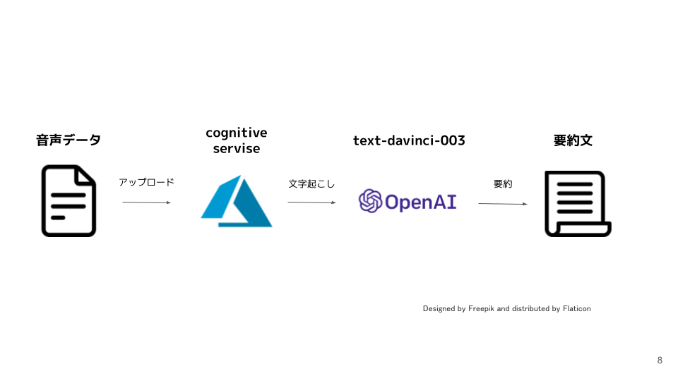

# 問題の抽出
会議は、多くの場合、情報共有や意思決定のための重要な場ですが、時間が限られているため、参加者が話した内容を全て把握することは難しいことがあります。特に長時間の会議や多人数の参加者がいる場合は、その課題はより深刻となります。そこで、会議の音声データから自動で要約を行うアプリを作ることで、参加者が話した内容を短時間で把握することができ、参加していない人たちにも会議の内容を把握してもらえます。また、会議に限らず、講義やインタビューなど、様々な場面で活用が期待されます。
# 検証内容
GenerativeAIを利用して、音声データの自動要約において、異なる技術的組み合わせ（例えばChatGPT, Whisper, azure cognitive servise）を適用した際に、どの組み合わせが最も精度が高く、かつ処理速度も安定しているかを検証することを目的としています。この検証を通じて、より優れた自動要約システムの構築を目指します。今回はversion1とversion2に分けて２種類のパターンでアプリを構築しました。
# version1
## azure cognitive servise & text-davinci-003
## 構成図

### 起動方法
```
docker build -t version1 .

docker run -p 8501:8501 -v path/to/file:/app version1
```
# version2
## Whisper & gpt-3.5-turbo
## 構成図

### 起動方法

docker build -t version2 .

docker run -p 8501:8501 -v path/to/file:/app version2


# 検証結果
version1では音声データの時間分の処理時間が必要でした。また処理可能な音声データフォーマットはwav限定でした。しかしversion2では,処理可能な音声データフォーマットは、mp3, m4a, wavとなり、処理時間も1/36に短縮することができました。
