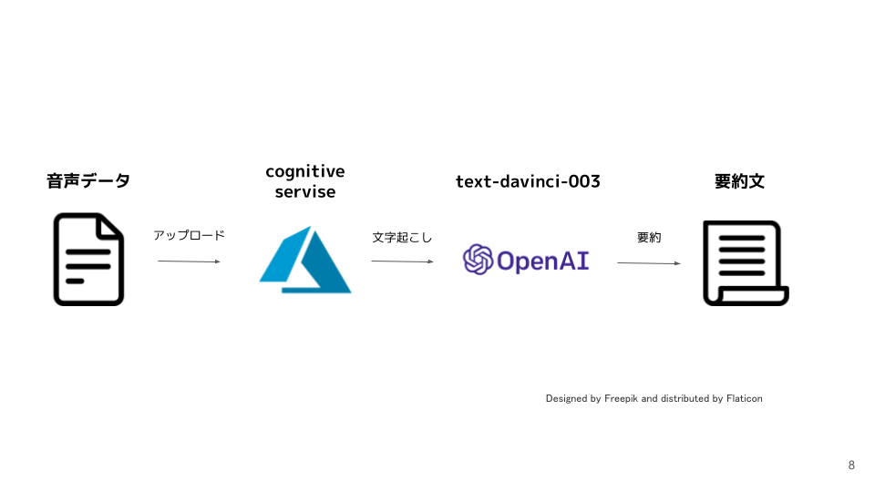

# 起動方法
```
docker build . -t version1

docker run -p 8501:8501 -v path/to/file:/app version1

```
# 構成図

# パラメーター説明
- speech_key
    - cognitive serviceのkey

- service_region
    - cognitive serviceのregion

- openai.api_key
    - OpneAIのAPI key

- max_takens
    - 返答に何トークン使うかを指定できる。しかしmaxの話なので結果300トークンぐらいでしか返答してこずあまりにも内容が薄くなってしまう。そこで今回はpromptに「700字で」を追記すると多少文字数が多く要約された（700字までは行かない）

- temperature
    - （ランダムさ。創造的にするには0.9、答えがある場合は0推奨。top_pと同時変更は非推奨（デフォルト:0.7））の通り創造性の度合いを示す。今回は要約という観点から新しい文章を作るというよりかは、同じようなフレーズを使って欲しかったためパラメータを0とした。


# OpneAIのAPIの使い方
- OpenAIのAPIページにアクセスし、「GET STARTED」ボタンをクリックします(SIGN UPでも可)
- OpenAIページの右上にアカウントアイコンが表示されるので、クリックして「View API keys」を選択します。
- 「API keys」のページに遷移するので、「+ Create new sercret key」ボタンをクリックします。
- APIキーが生成されるので、赤枠のコピーアイコンをクリックし、OpenAIのAPIキーを取得します。
- 発行したAPIキーを使い、ドキュメントに従ってAPIリクエストすれば、OpenAIのサービスがAPI経由で利用できます。
- またpayment methodsも追加しておく（https://platform.openai.com/account/billing/overview）
https://auto-worker.com/blog/?p=6988

# cognitive service 音声リソース作成方法
- アカウント登録
    - https://www.teijitaisya.com/azure-cognitive-services/#index_id6
- cognitive service ->　音声サービス -> 作成
    - リソースグループ、リージョンは日本、リソース名を決める
    - ネットワーク
        - インターネットを含むすべてのネットワークがこのリソースにアクセスできます。
    - identity
        - システム割り当て ID を有効にして、リソースに他の既存のリソースへのアクセスを許可します。をオフ
- 作成したリソースをクリック -> キーとエンドポイント -> ここでキーとリージョンを取得

# Azure Cognitive Servicesをコンソールで音声ファイルからテキストファイル生成する場合
- アカウント登録
    - https://www.teijitaisya.com/azure-cognitive-services/#index_id6
- リソース作成
- CLIインストール(https://learn.microsoft.com/ja-jp/azure/cognitive-services/speech-service/spx-basics?tabs=macOS%2Cterminal#download-and-install)
- .NET 6 をインストールします。
    - dotnet tool install --global Microsoft.CognitiveServices.Speech.CLI
    - dotnet tool update --global Microsoft.CognitiveServices.Speech.CLI
- 音声リソースのキーを登録
    - ~/.dotnet/tools/spx config @key --set xxxxxxxxx
- リージョンを登録
    - ~/.dotnet/tools/spx config @region --set japaneast
- 変換実行
    - ~/.dotnet/tools/spx recognize --file ~/Downloads/sampleTokyo.wav --source ja-JP